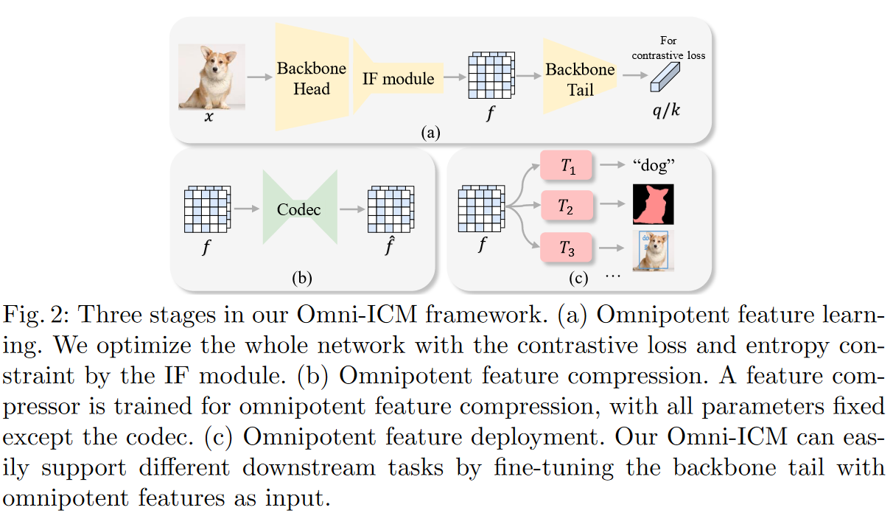
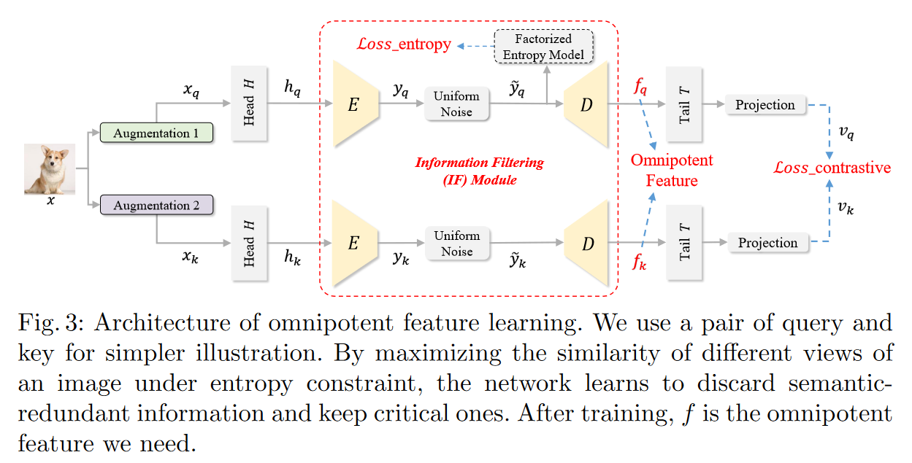

---
layout: post
title: template page
categories: [cate1, cate2]
description: some word here
keywords: keyword1, keyword2
mermaid: false
sequence: false
flow: false
mathjax: false
mindmap: false
mindmap2: false
---

# Image Coding for Machines with Omnipotent（全能的） Feature Learning

### Abstract

Image Coding for  Machines (ICM)，目标是为下游的AI任务分析来压缩。

目的：general, compact

提出学习通用特征的框架：Omni-ICM。

将SSL（自监督学习）与压缩任务继承到Omni-ICM框架中学习全能特征(omnipotent feature)

难点：将SSL中的语义建模和压缩中的冗余除去协调起来并非易事 -> 设计一个新的信息过滤（IF）模块，通过实例区分和熵最小化的协同优化，自适应地丢弃与AI任务弱相关的信息。

### Intro

以人的感知为导向的度量和AI任务的度量之间的差异使得ICM和已经存在的范式之间有所不同。

这类面向下游任务的方法之前主要有两种：

1.(a) 图像的重构会带来更多的计算负担，语义完整性和纹理精准性之间存在新的tradeoff

1.(b) 一个提取的特征只能用于一个特定的下游任务。

提出了新的ICM框架来探索不同AI任务的common knowledge.

已有的idea中对比学习能够学习到general and transferable visual presentation，但是直接压缩从对比目标（函数）来的特征与直接压缩原图相比没有优势，原因在于特征通常会保持许多非相关的、冗余的信息，如果在信息熵熵没有精准的限制的话

为了解决这个问题，进一步设计了Information Filtering（IF）模块，来在压缩前智能的抛弃掉冗余信息。

IF模块 = Encoder + Decoder + Entropy Estimation Model

优化方式：对比损失和熵最小化限制

### ICM with Omnipotent Feature Learning

#### Overview of Omni-ICM Pipeline

IF模块：为了协调保留的语义信息和抛弃的语义不相关冗余

#### Stage 1: Omnipotent Feature Learning

##### Basic Network Archtecture

采用$4\times$下采样因子来提取Omniponent Feature $f$，以保证内容结构和布局空间的完整性。

backbone: 以ResNet-50为例，Head = Layer 1; Tail = Layer 2 + Layer 3 + Layer 4

##### Data Augmentation and Feature Extraction in Backbone Head

$H_q\times W_q \rightarrow \frac{H_q}{4}\times\frac{W_q}{4}\times C$

##### Information Filtering Module

E: $8\times$下采样，$y_q$：$\frac{H_q}{32}\times\frac{W_q}{32}\times C_y$

全分解熵模型：$p_{\tilde y_q|\phi_o}(\tilde y_q|\phi_o)=(\prod_ip_{\tilde y_q|\phi_o}(\phi_o)*\mathcal U(-\frac{1}{2},\frac{1}{2}))(\tilde y_q)$

熵损失：$\mathcal L_e=\mathbb E[-\log_2(p_{\tilde y|\phi_o}(\tilde y_q|\phi_o))]$

D: 恢复到与IF module的输入一致

##### Backbone Tail and Projection Layer

用来map the feature to the space where contrastive loss is applied.

projection layer是具有一层隐藏层的MLP：

$$
q=W^{(2)}\sigma(W^{(1)}(T(D(\tilde y_q))))
$$

 $\sigma$是Relu激活层，W是全连接层

##### Generation of Keys

同query的生成

##### Total Optimization Objectives

InfoNCE：

$$
\mathcal L_q=-\log\frac{\exp(q\cdot k_+/\tau)}{\exp(q\cdot k_+/\tau)+\sum_{k_-}\exp(q\cdot k_-/\tau)}
$$

总的优化函数：

$$
\mathcal L=\mathcal L_q+\alpha\mathcal L_e
$$

#### Stage 2: Learning-based Feature Compression

和有损图像压缩一样，优化$R+\lambda D_C$

$$
\mathcal L_{rd}=\mathbb E[-\log_2(p_{\hat y|\psi}(\hat y|\psi))]+\lambda \frac{1}{WH}\sum_{x=1}^{W}\sum_{y=1}^{H}(f_{x,y}-\hat f_{x,y})^2
$$

更多的，因为压缩的特征是用来更好的处理下游任务，我们进一步在更深的特征层次保护语义保真性。（计算更深层次的特征表示，即backbone tail中的每一层）

$$
\mathcal L_f=\sum_{i=2}^4\lambda_i\frac{1}{W_iH_i}\sum_{x=1}^{W_i}\sum_{y=1}^{H_i}(\phi_if_{x,y}-\phi_i\hat f_{x,y})^2
$$

$\phi_i$表示一个可微函数

总的损失函数：

$$
\mathcal L_{com}=\mathcal L_{rd}+\mathcal L_f
$$

#### Stage 3: Feature Deployment and Task Supporting

在训练好的omnipotent features上训练task models。

形式上，只对主干尾部进行微调来支持下游任务

### Experiments

#### Datasets

Training: ImageNet

Evaluate: PASCAL VOC, MS COCO, Cityscapes

### Conclusion

提出了新的框架Omni-ICM

SOTA
