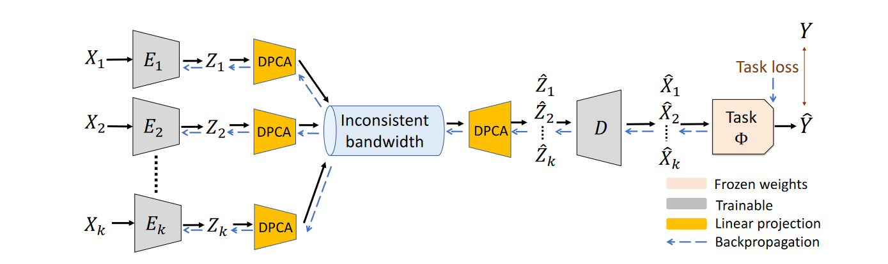
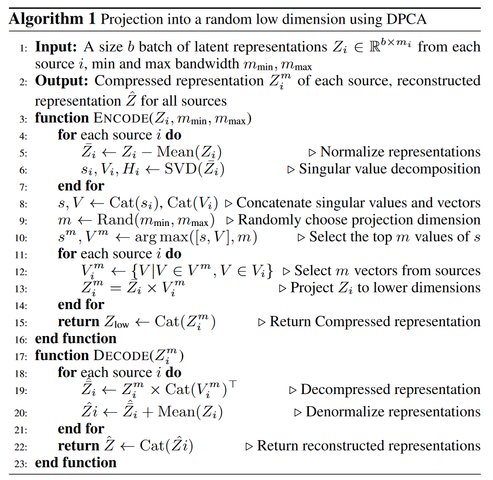
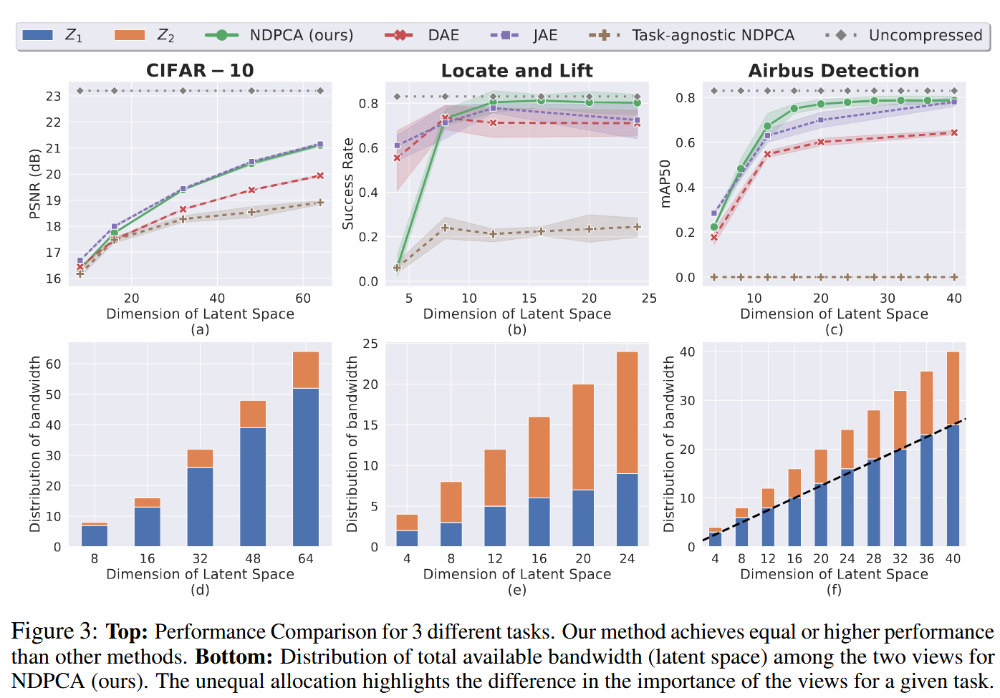

# 在动态带宽下任务感知的分布式信源编码

## 简介

本文设计了一个新的分布式压缩框架，这个框架包括一些独立的编码器以及一个共同的解码器，本文称之为**神经分布主成分分析(Neural Distributed Principle Component Analysis, NDPCA)**。该方法通过学习低秩任务的表示并在传感器之间有效地分配带宽，实现在任意可行的带宽下通过单一的模型压缩多个信源的数据，从而在性能和带宽之间提供了优雅的权衡，减小了计算和存储开销。

实验显示，与均匀分配带宽的自编码器相比，NDPCA能够将多视角机器臂操纵的成功率提高9%，将在卫星图像上的目标检测任务的准确率提高了14%

## Introduction

作者首先介绍了传输带宽的限制对多传感器网络的限制，并且传感器收集到数据大多用于下游任务，因此，信源应该只传输与下游任务相关的特征。此外，对每个源独立压缩以减少网络中的通信过载也十分重要。作者将这类任务相关特征的分布式压缩统称为**任务感知的分布式信源编码(task-aware distributed source coding)**

作者认为，现有的压缩方法有以下三点不足：

1. 现有的分布式压缩方法在存在下游任务模型的情况下性能较差，主要关祖殿在图像重构而非面向下游任务。
2. 现有的任务感知压缩方法没有利用信源的相关性。
3. 现有的所有方法，尤其是基于神经网络的方法，只是将数据压缩到一个固定的压缩级别而非多个压缩级别。

因此，作者设计了一个分布式压缩的框架NDPCA，能够在多个压缩级别传输与任务相关的特征。在NDPCA中，作者认为中心节点处的任务模型需要所有信源的数据，并且随着时间的推移网络中会出现带宽不一致的现象。

在NDPCA中，通过一个被称作分布式主成分分析(DPCA)的模块，根据当前的带宽将中间表示压缩到任意低维，并在中心节点解压缩数据。通过引入下游任务的相关损失，本文回避了训练下游任务模型。

作者认为本文的贡献有三点：首先，本文构建了一个任务感知的分布式信源编码问题，这个问题的目标是针对给定任务优化，而非重构。第二，本文分析了一个线性压缩器和一个任务的例子来为该框架提供理论证明。第三，本文提出了一个任务感知的分布式信源编码框架NDPCA，该框架针对不同的压缩级别学习一个模型。

作者用CIFAR-10图像去噪任务、多视角机器臂操纵任务、卫星图像目标识别任务来验证NDPCA，结果相比于带宽均匀分配的自编码器，分别得到了PSNR上1.2dB的增加、9%的成功率增加和14%的准确率增加。

## 问题阐述

定义集合$K$为相关信源，$x_i$为从信源$i$中采样的数据，$i\in\{1,2,\cdots,K\}$。从每t个信源$i$采集到的数据会独立的被编码器$E_i$压缩为潜在表示$z_i\in\mathbb R^{m_i}$，$m_i$表示每个信源通道的带宽，$m$表示总带宽，所以用$\sum_{i=1}^Km_i=m$。一个共同的解码器$D$接收到了潜在表示$\{z_1,\cdots ,z_K\}$，并且重构为$\{\hat x_1,\cdots,\hat x_K\}$。任务$\Phi$会通过重构的信源计算出任务的输出$\Phi(\hat x_1,\cdots,\hat x_K)$。目标为最小化任务的损失函数：

$$
\arg \min_{E_1,\cdots,E_K,D}
\mathcal L_{task}(\Phi(x_1,x_2,\cdots,x_k),\Phi(D(E_1(x_1),\cdots,E_K(x_K))))
$$

其中$\mathcal L_{task}$是任务的损失。

对于带宽分配的任务，给定总可用带宽$m$，首先需要获得每个源$i$的最优的$m_i$，然后可以设计最优的编码器和解码器。

## DPCA理论分析

本章阐述线性DPCA方法和性能分析。即本文网络中的DPCA块的理论。

### DPCA阐述

考虑到两个源的线性任务，定义为任务矩阵$\Phi\in\mathbb R^{p\times(n_1+n_2)}$，其中信源$x_1\in \mathbb R^{n_1}$和$x_2\in\mathbb R^{n_2}$分别是$n_1$和$n_2$维的。任务输出为$y=\Phi x\in\mathbb R^p$，其中$x=[x_1^T,x_2^T]^T$。不失一般性，假设信源为零均值。现在，对两个信源采样$N$次$X_1\in\mathbb R^{n_1\times N}$，$X_2\in\mathbb R^{n_2\times N}$，并且得到对应的任务输出$Y=\Phi(X)\in\mathbb R^{p\times N}$，其中$X=[X_1^T,X_2^T]^T$

DPCA目的相当于优化下列子问题：

$$
\begin{align}
M^*&=YZ^T\\
E_1^*&=\arg\min_{E_1}||\Phi_1X_1X_1^TE_1^T||^2_2\\
&s.t.E_1X_1X_1^TE_1^T=\mathbb I_{m_1}\\
E_2^*&=\arg\min_{E_2}||\Phi_2X_2X_2^TE_2^T||^2_2\\
&s.t.E_2X_2X_2^TE_2^T=\mathbb I_{m_2}\\
\end{align}
$$

子问题是典型相关分析，可以通过奇异值分解解决。

### 动态带宽

在上一节中解决了在固定带宽$m_1,m_2$下的问题，这一节描述给定总带宽$m$下确定最优带宽分配的方法。

通过上一节的问题得到$E_1^*,E_2^*$的所有典型方向和相关性，类比于PCA方法中的奇异向量和奇异值，典型相关性表现了一个方向对任务的重要性。DPCA将典型相关性按照降序排序，选择前m个典型相关性及其对应方向，这些典型相关性决定了最优编码器$E_1^*,E_2^*$和解码器$D^*$，从而间接求解了$m_1,m_2$。

### DPCA的性能分析

在实际情况中，编码器间无法通信，为了使DPCA在跳过预处理依然获得最佳性能，两个数据矩阵需要不相关。本文在引理3.1中刻画了在相同带宽下联合压缩PCA和分布式压缩DPCA的性能。

> 引理3.1：DPCA重构的边界
>
> 给定零均值数据矩阵和它的协方差
>
> $$
> X=\begin{bmatrix}X_1\\X_2\end{bmatrix}\in\mathbb R^{(n_1+n_2)\times N},\\XX^T=\begin{bmatrix}\text{Cov}_{11}&0\\0&\text{Cov}{22}\end{bmatrix}+\begin{bmatrix}\text{Cov}_{11}&0\\0&\text{Cov}{22}\end{bmatrix}
> $$
>
> 第一项是$X_{\text{diag}}$，第二项是$\Delta X$，假设$\Delta X$比$XX^T$相对小，并且$XX^T$是正定的，具有不同的特征值。对于PCA的编解码矩阵$E_{PCA},D_{PCA}$和DPCA的编解码矩阵$E_{DPCA},D_{DPCA}$，重构损失的差异是有界的，
>
> $$
> 0\le||X-D_{DPCA}E_{DPCA}(X)||^2_2-||X-D_{PCA}E_{PCA}(X)||^2_2=-\sum_{i=m+1}^{n_1+n_2}\lambda_ie_i^T\Delta Xe_i
> $$
>
> 其中$\lambda_i$和$e_i$是$XX^T$的第$i$大的特征值和特征向量，$m$是压缩瓶颈的维数

引理3.1表明，当数据相关性较小时，DCPA更有效。

## 神经分布式主成分分析(NDPCA)

之前的分析中表明DPCA有两点缺点：它只在信源不想关的情况下对数据进行最优压缩，并且只适用于线性任务。然而，DPCA根据信源的重要性动态分配带宽。另一方面，神经网络能有效压缩数据到固定维度，但不能动态分配带宽。所以作者想要结合一个神经自编码器来生成表示，然后通过DPCA来压缩和找到带宽的分配，提出了NDPCA。

NDPCA编码分为两阶段，首先神经编码器将数据$X_k$压缩到固定维度潜在表示$Z_k$，接着用DPCA的线性编码器根据可用带宽和信源间的相关性，通过线性投影自适应$Z_k$的维度。同样的，解码也分为两阶段。首先用DPCA重构原始固定维度的特征表示，然后用神经联合解码器生成估计的数据$\hat X_k$，然后将这种估计传输到下游任务得到下游任务结果$

在训练过程，目标是最小化损失函数来学习$K$个神经编码器和联合神经解码器。

$$
\mathcal L_{tot}=\lambda_{task}||\hat Y-Y||^2_F+\lambda_{rec}\sum_{i=1}^K||\hat X_i-X_i||^2_F
$$

作者尝试过在损失函数中显式加入其他项来得到想要的性质，但是这样做反而印象了任务性能。对此，作者提出了一种新颖的线性压缩模块，允许在训练过程中适应DPCA，而不失在损失中加入额外项。

作者引入了一个随机维度的DPCA投影模块来提高低带宽下的性能，它将潜在表示Z投影到随机选择的低维空间，模拟推理过程中不同可用带宽的投影。具体算法如算法1所示。

在推理过程中，当当前带宽为$m$时，选择保存编码器和解码器矩阵的前$m$行和前$m$列进行编解码，不需要重新训练，只需要在每个编解码器处存储一个神经自编码器和一个线性矩阵。

本文预训练使用随机裁剪和数据增强的任务模型，使得模型对噪声不敏感。

## 实验

作者使用三个不同的任务来测试框架：CIFAR-10图像的去噪任务，多视角机器臂操纵任务（定位和抬升），卫星图像目标检测任务。

作者比较的基准：任务感知联合自编码器(JAE)·，任务感知简单分布式自编码器(DAE)，任务无关的NDPCA。

作者最后讨论了模型缺点。首先当测试集与训练集存在明显差异时，NDPCA的性能会明显降低。另外，DPCA在训练集中进行奇异值分解，如果批次规模太小，分解操作可能变得病态和不稳定。

## 总结

作者聚焦于分布式压缩中不同信源所携带的有效信息不同，从而应当分配的带宽不同这一问题，基于神经网络方法高效提取特征但不能变化带宽的特点和DPCA方法动态分配带宽但只适用于无关数据和线性变换的特点，结合二者的优势提出了NDPCA框架。此外，该框架成功的将分布式压缩任务和面向下游任务的压缩任务结合，对于需要运用多个信源的下游任务有着很好的效果，并对于任务的特点，在训练阶段提出了随机低维度投影算法提高模型性能。实验结果表明模型在任务感知的分布式信源编码任务上取得了很好的效果。
